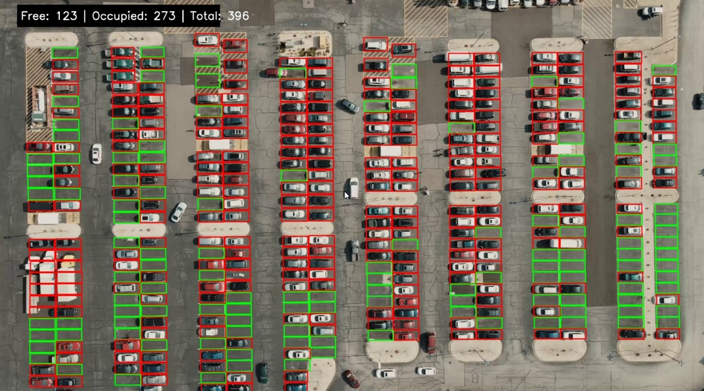

# Parking Detection 🚗🅿️

Automatski sustav za detekciju zauzetih i slobodnih parking mjesta pomoću računalnog vida.  
Projekt koristi **Python** i **OpenCV** za obradu videa te generira izlazni video s označenim slobodnim i zauzetim mjestima.

---

## 🚀 Značajke

- ✅ Detekcija slobodnih i zauzetih parking mjesta  
- ✅ Vizualizacija pomoću **bounding boxova**  
  - 🟢 zeleno = slobodno  
  - 🔴 crveno = zauzeto  
- ✅ Brojač slobodnih i zauzetih mjesta  
- ✅ Generiranje renderiranog izlaznog videa koji se može preuzeti  
- ✅ Modularna arhitektura (backend + frontend)  
- ✅ 100% točnost na dostupnim testnim podacima  

---

## 🖼️ Demo

### Screenshot


### Video
[Demo Video](backend/rendered_videos/fb4bdb5c-c0e8-4f65-a485-96b4a1509ac8.mp4)

### Live verzija
[Live Site](https://tvoj-live-link.com)

---

## 📂 Struktura projekta

```
ParkingDetection/
├── backend/
│ ├── model/ # Trening.py i model.pkl
│ └── main.py # Glavni Python skript za pokretanje
├── frontend/ # Web sučelje (upload videa i vizualizacija)
├── venv/ # Virtualno okruženje (nije obavezno za GitHub)
├── .gitignore
└── README.md # Dokumentacija
```

---

## ⚙️ Instalacija i pokretanje

1. Kloniraj repozitorij:

```
git clone https://github.com/Kico611/ParkingDetection.git
cd ParkingDetection
```

2.Instaliraj potrebne pakete:

```
pip install -r requirements.txt
```
3.Pokreni backend:

```
python backend/main.py
```
4.Otvori frontend u pregledniku i uploadaj video za detekciju.

---

## 📊 Performanse
Točnost: 100% na dostupnim testnim podacima

Način rada: Offline – korisnik šalje MP4 video, sustav ga obradi i generira izlazni video

Latencija: Ovisi o duljini i rezoluciji videa (nije real-time)

Ograničenje: Testirano samo na jednom setu snimki – performanse u različitim uvjetima još nisu evaluirane

---
## 🛠️ Tehnologije
Python 3.10+

OpenCV

NumPy

FastAPI (backend API)

HTML / CSS / JavaScript(React) (frontend)

---
## 🔮 Moguće nadogradnje
Testiranje u različitim vremenskim i svjetlosnim uvjetima

Real-time obrada (kamera → live detekcija)

Integracija YOLO / Mask R-CNN modela za automatsko prepoznavanje parking slotova

Integracija s mobilnom aplikacijom

Deployment na Raspberry Pi + kamera za pametna parking rješenja

---
## 👨‍💻 Autor
Kristijan Balić
