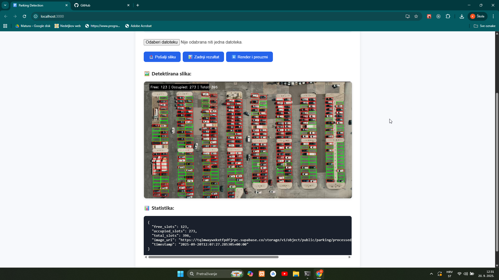

## 🚗🅿️ Parking Detection

Automatski sustav za detekciju zauzetih i slobodnih parking mjesta pomoću računalnog vida.  
Projekt koristi **Python** i **OpenCV** za obradu videa te generira izlazni video s označenim slobodnim i zauzetim mjestima.

---

## 🚀 Značajke

- ✅ Automatska detekcija slobodnih i zauzetih parking mjesta  
- ✅ Vizualizacija rezultata pomoću **bounding boxova**  
  - 🟢 Zeleno = slobodno  
  - 🔴 Crveno = zauzeto  
- ✅ Brojač slobodnih i zauzetih mjesta u realnom vremenu  
- ✅ Generiranje renderiranog izlaznog videa za preuzimanje  
- ✅ Modularna arhitektura s odvojenim backend i frontend slojem  
- ✅ Visoka točnost detekcije na dostupnom testnom skupu podataka

---

## 🖼️ Demo

### Screenshot

### GIF

## Video Walkthrough(Click on image!)

---

## ⚙️ Metode i algoritam

Detekcija zauzetosti parking mjesta kombinira računalni vid i strojno učenje:

1. **Definicija parking mjesta (ROI)**  
   - Parking mjesta su definirana maskom (`mask_1920_1080.png`).  
   - Koristi se `cv2.connectedComponentsWithStats` za automatsko izvlačenje bounding boxova svakog parking mjesta.

2. **ML model za klasifikaciju**
   - Skup podataka se sastoji od slika parking mjesta podijeljenih u dvije kategorije: empty (slobodno) i not_empty (zauzeto).

   - Svaka slika se resize-a na 15×15×3 piksela i flatten-a u vektor.

   - Podaci se dijele u 80% trening i 20% test uz stratifikaciju klasa.

   - Koristi se Support Vector Machine s optimizacijom parametara (C i gamma) pomoću GridSearchCV.

   - Najbolji model se evaluira na testnom skupu (accuracy_score) i sprema u model.p za kasniju upotrebu.

   - Primjer rezultata: 100% točnosti na testnom skupu (ovisno o datasetu, stvarna točnost može varirati).

3. **Video heuristika i optimizacija**  
   - Za video detekciju ne provjeravaju se sva mjesta u svakom frameu.  
   - Koristi se funkcija `calc_diff` koja mjeri promjenu između trenutnog i prethodnog framea za svako mjesto.  
   - Samo mjesta s dovoljno velikom promjenom se ponovno klasificiraju, što značajno smanjuje računsku kompleksnost.

4. **Vizualizacija i output**  
   - Slobodna mjesta označena zelenim, zauzeta crvenim bounding boxovima.  
   - Overlay s brojem slobodnih, zauzetih i ukupnih mjesta.  
   - Generira se renderirani video i JSON zapis sa statusom parkinga za backend/frontend integraciju.

⚠️ **Ograničenja trenutne metode:**  
- Osjetljivost na sjene i promjene svjetla.  
- Radi samo s fiksnim kamerama (ROI unaprijed definirani).  
- Heuristika za video detekciju može propustiti brze promjene između frameova.

---

## 🏗️ Arhitektura sustava

Video Input (MP4 Upload) / Slika  
⬇️  
Backend (Python + FastAPI)  
- ML model i OpenCv obrada
- Detekcija zauzetih mjesta  
- Generiranje JSON & video  
⬇️  
Frontend (React)  
- Upload videa  
- Vizualizacija  
- Statistika  
⬇️  
☁️ Pohrana / Cloud (Firebase / Supabase)

**Opis tijeka podataka:**  
1. Korisnik učitava MP4 video/slika putem frontend sučelja.  
2. Backend obrađuje video/sliku kroz ML model i OpenCV.  
3. Sustav generira renderirani video i JSON zapis sa statusom parkinga.  
4. JSON zapis se pohranjuje u Firebase, a slike/video u Supabase.  
5. Frontend prikazuje rezultate s vizualnim oznakama i statistikom.

---

## 📂 Struktura projekta

- **backend/model/** – Sadrži sve što je vezano uz strojno učenje: trening skriptu i spremljeni model.
- **backend/detect_parking.py** – Implementacija glavnih funkcija detekcije.
- **backend/utils.py** – Pomoćne funkcije za obradu podataka i podršku glavnom algoritmu. 
- **backend/main.py** – Pokreće cijeli backend sustav, uključujući učitavanje modela, obradu videa/slika i generiranje outputa.  
- **frontend/** – React-based web aplikacija za prikaz rezultata detekcije, upload videa i vizualizaciju slobodnih/zauzetih mjesta.  .  
- **.gitignore** – Definira koje datoteke i mape Git ignorira (npr. venv, temp files).  
- **README.md** – Dokumentacija projekta s opisom, uputama za pokretanje i primjerima outputa.

---

## ☁️ Pohrana i cloud integracija

- **Slike detekcija**: Renderirane slike i videozapisi s označenim parking mjestima spremaju se u **Supabase bucket**. Svaka slika dobiva jedinstveni link.  

- **Status parkinga**:  
  JSON zapis sadrži:  
  - `free_slots` – broj slobodnih mjesta  
  - `occupied_slots` – broj zauzetih mjesta  
  - `total_slots` – ukupni broj mjesta  
  - `image_url` – link na sliku u Supabase  
  - `timestamp` – vrijeme detekcije

  Podaci se pohranjuju u **Firebase**, što omogućuje frontend prikaz i analitiku zauzetosti u stvarnom vremenu.  

---

## 📊 Performanse
Točnost: Visoka točnost na dostupnim testnim podacima

Način rada: Offline – korisnik šalje MP4 video, sustav ga obradi i generira izlazni video

Latencija: Ovisi o duljini i rezoluciji videa (nije real-time)

Ograničenje: Testirano samo na jednom setu snimki – performanse u različitim uvjetima još nisu evaluirane

---

## 🛠️ Tehnologije
- **Python 3.10+**
  
- **OpenCV**
  
- **NumPy**
  
- **FastAPI**
  
- **React (HTML / CSS / JavaScript)**

---

## 🔮 Moguće nadogradnje
Testiranje u različitim vremenskim i svjetlosnim uvjetima

Real-time obrada (kamera → live detekcija)

Integracija YOLO / Mask R-CNN modela za automatsko prepoznavanje parking slotova

Integracija s mobilnom aplikacijom

Deployment na Raspberry Pi + kamera za pametna parking rješenja

---
